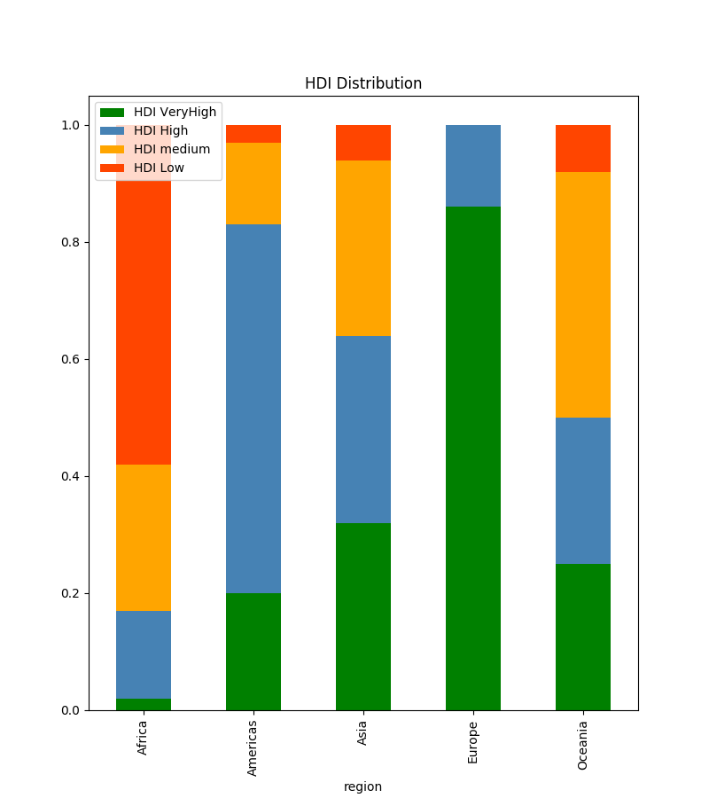

# Web Scraping and API mastering | Project

## Introducción
This project create added value in the analysis of the Human Development Index provided by the UN in 2019, generating key statistical data to understand the impact of this index on the global prospective.

## Methodology
API integration using DataSets as main source. Argparse function y FPDF to create added value reports. The flags for the argparse are:
 - -top | Compare statistic values of top 10 countries UP and DOWN.
 - -region | Show region report and generate graphs
 - -filt | Filter HDI values to obtain a range of subregion values.
 - -repo | Create pdf report.

## Keywords
api, web scraping, argparse, fpdf

## Input
- DATASET | [Human Developement Index of 2019](http://hdr.undp.org/en/content/human-development-index-hdi), Life Expectation and Expected and Actual years of schooling. 
- API | [Rest Countries](https://restcountries.eu/) Country information about population, international code, flag, capital city...

## Output
- DATAFRAME | CSV information of both source together.
- Graphs | Population, GNI per capita and Life Expectation by region (Europe, Asia...)

- Reports

## Contributing
Pull requests are welcome. For major changes, please open an issue first to discuss what you would like to change.

Please make sure to update tests as appropriate.

## Project status
Learning and enjoying everyday.

Next steps:
- WEB SCRAPING | [CountryFlags](https://www.countryflags.io/)
- Repo improve.
